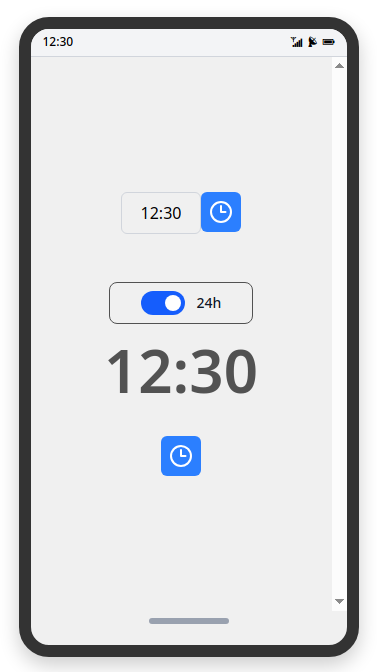
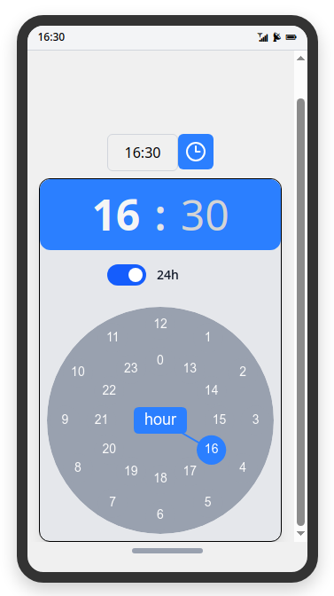
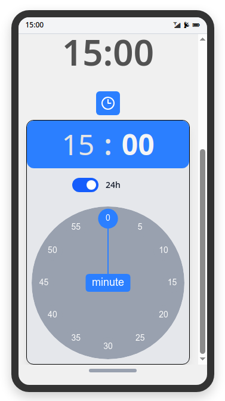

# TimePicker for Vue3 with Tailwind CSS v4

A simple and customizable time picker component for Vue 3, built with Tailwind CSS v4.

# Features

- Easy to use and integrate into your Vue 3 projects
- Fully customizable with Tailwind CSS
- Supports 12-hour and 24-hour formats
- Lightweight and fast
- No external dependencies but Vue 3 and Tailwind CSS v4
- MIT License

# Demo

De live demo van de applicatie kun je hier bekijken:

[http://vuetimepicker.bqsystems.be/](http://vuetimepicker.bqsystems.be/)

# Screenshots





# Installation

```bash
pnpm install  
```

# Run dev

```bash
pnpm run dev
```

# How to use

Copy the `src/components/*.vue` file to your project

## TimePicker and InputTimePicker

Use TimePicker component or InputTimePicker in your project as (see also code in App.vue):

```vue
<script setup lang="ts">
  import { ref } from 'vue';
  const is24h = ref<boolean>(true);
  const time = ref<string>('12:30');
</script>
<template>
  <InputTimePicker v-model:is24h="is24h" v-model:time="time "></InputTimePicker>
  <TimePicker v-model:is24h="is24h" v-model:time="time "></TimePicker>
</template>
```

## ClockDial

You can use the ClockDial component in your own TimePicker project. More details in code of TimePicker.vue or InputTimePicker.vue code.

```vue

<ClockDial ref="canvasRef"
           :mode="selecting"
           :hour="localHour"
           :minute="localMinute"
           :is24h="safeIs24h"
           :is-open="isOpen"
           :pm="pm"
           @update="onClockSelect"
           @updatePm="onUpdateAmPm"
           @switch="switchToMinutes"></ClockDial>
```

# License

MIT licensed: [](LICENSE.md)

# About

## Project Info

Source code available on [GitHub](https://github.com/paul908/vue-tailwind-timepicker).

## Author

**Paul Becue**
[BQ Systems](https://bqsystems.be) – Oostende, Belgium
📧 [paul.becue@gmail.com](mailto:paul.becue@gmail.com)
